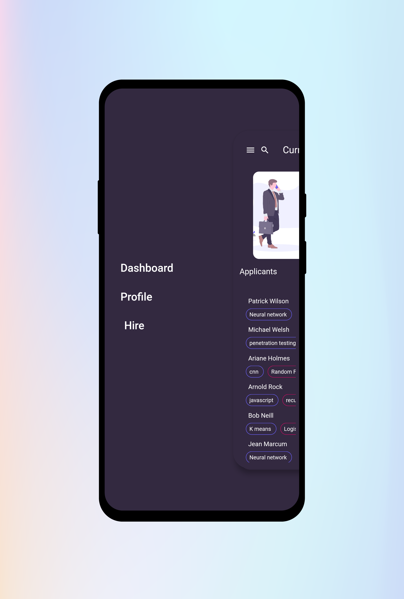
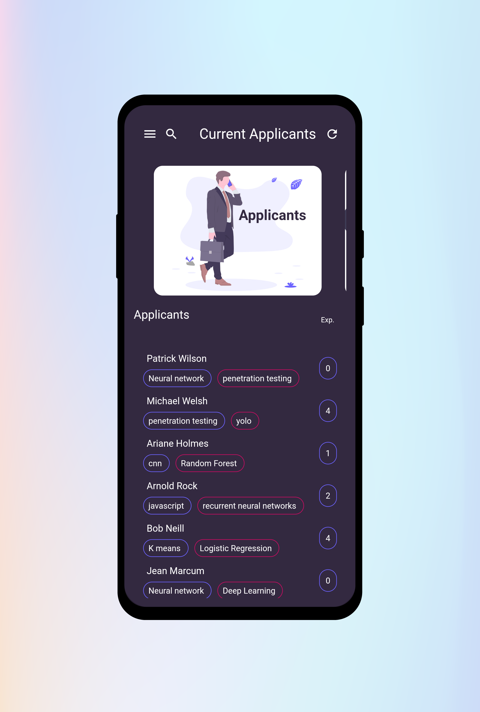
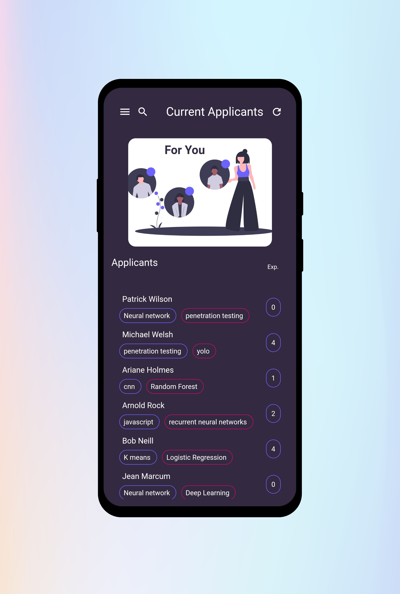
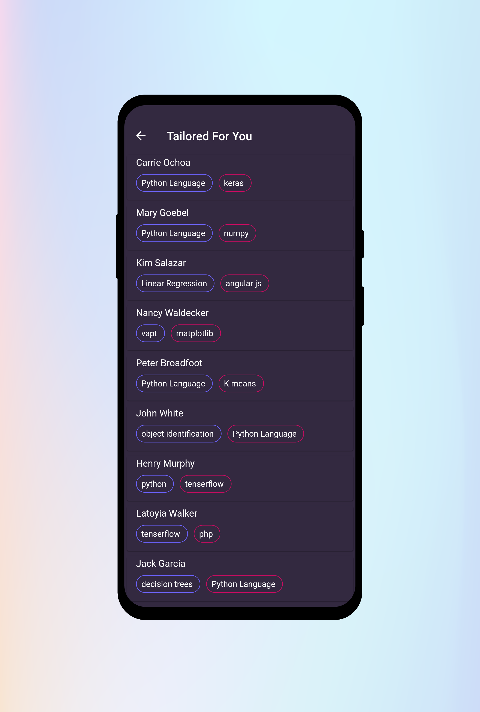
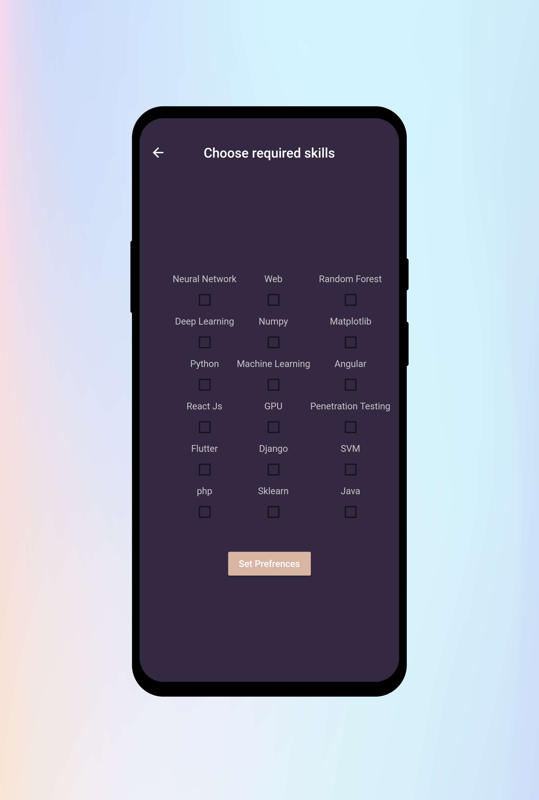

<h1 align="center">Filter Me</h1>

**Filter me is a cross platform application, which helps recruiters to find relevant and the most recommended candidates for a particular job position.**

# Why Filter Me

1. One of the cleanest UI friendly app out there, Filter Me uses machine learning to segregate resumes according to the groups and skills of the candidates, and sorts them.
2. It also suggests candidates suitable for your job position taking into consideration the skills and experience of the candidates below.

# Screenshots

### Tech Stack of this Project:

* Frontend: Flutter Application
* Backend: Python3
* Framework: Flask
* Machine Learning Model: en_web_core_sm (NLP)
* Libraries: Available in [requirements.txt](./server/requirements.txt).

### To run the project:

* [Fork](https://github.com/nachiketbhuta/filter-me) this Repository.
* Change into he directory in the terminal and run as:
  -`cd server`
  -`pip3 install -r requirements.txt`
  -`python3 manage.py runserver`
* Open your web browser and enter the following URL:
`localhost:8000`

#### This project still has scope of development, so you can also contribute to this Project as follows:
* [Fork](https://github.com/nachiketbhuta/filter-me) this Repository.
* Clone your Fork on a different branch:
	* `git clone -b <name-of-branch> https://github.com/nachiketbhuta/filter-me.git`
* After adding any feature:
	* Goto your fork and create a pull request.
	* We will test your modifications and merge changes.

This project was done as a part of CSI - KJSCE HackIt 2.0 Hackathon 2020 `with no pre-preparation in less than 24 hours.`

---
<h3 align="center"><b>Developed with :heart: by Team Stochastic.</b></h1>
